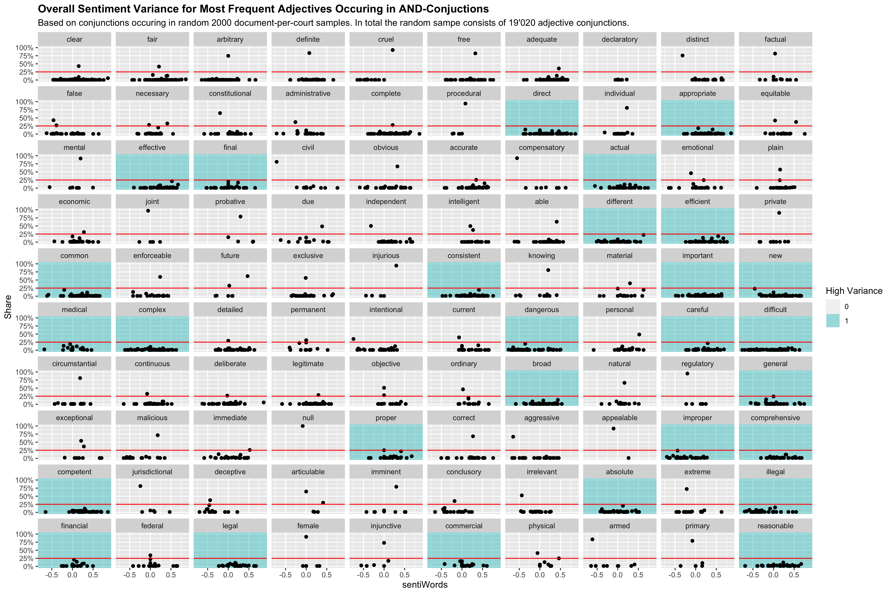
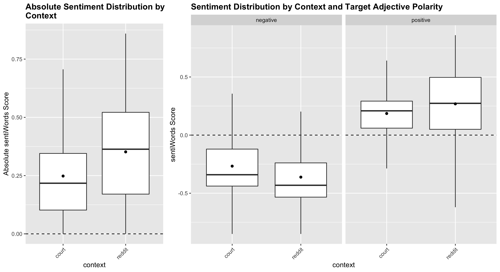
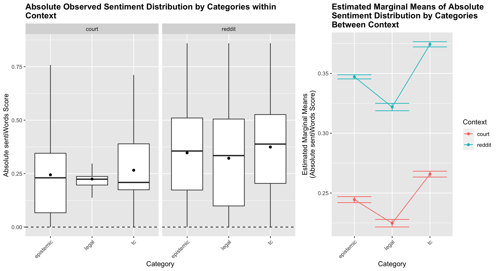

README
================
Lucien Baumgartner
7/23/2020

  - [WIP: To Dos](#wip-to-dos)
      - [Process](#process)
      - [Analysis](#analysis)
      - [Scripts](#scripts)
  - [Data](#data)
  - [Hypotheses](#hypotheses)
      - [Global Context Effects](#global-context-effects)
      - [Within Context Effects](#within-context-effects)
      - [Differences of Within Context Effects Across
        Contexts](#differences-of-within-context-effects-across-contexts)
      - [Choose Target Adjectives](#choose-target-adjectives)
  - [Results](#results)
      - [H1 / H1a / H1b](#h1-h1a-h1b)
      - [H2a / H2b](#h2a-h2b)
      - [H3a / H3b / H3c](#h3a-h3b-h3c)
  - [Script Workflow](#script-workflow)
      - [Gather Data](#gather-data)
      - [Make Corpora](#make-corpora)
      - [Change Reddit Data ex post](#change-reddit-data-ex-post)
          - [Gather new reddit data
            selectively](#gather-new-reddit-data-selectively)
          - [Remove obsolete reddit data](#remove-obsolete-reddit-data)
  - [Text Data Treatment Overview](#text-data-treatment-overview)
  - [Setup Config](#setup-config)
      - [Software Versions](#software-versions)
      - [Full List of Dependencies](#full-list-of-dependencies)

## WIP: To Dos

### Process

  - [x] explorative adjective mapping

### Analysis

  - [ ] Graphical pre-analysis
  - [ ] test ANOVA-assumptions
  - [ ] parametric/non-parametric analysis
      - [ ] H1
      - [ ] H1a
      - [ ] H1b
      - [ ] H2a
      - [ ] H2b
      - [ ] H3
      - [ ] H3a
      - [ ] H3b
      - [ ] H3c

### Scripts

  - [x] adapt paths
  - [ ] write statistical analysis scripts

## Data

The data is all bulk data that are processed into two corpora, a legal
one and a baseline (= reddit comments). The current baseline might be
substituted with another, more traditional corpus later in the process.

bulk-data:

  - reddit comments; time period: 01.01.2020-30.06.2020, max. 1000
    comments per search and day; SOURCE: [pushshift
    API](https://pushshift.io/api-parameters/) (retrieved 21.07.2020,
    open data)
  - [court
    opinions](https://legal-dictionary.thefreedictionary.com/Court+Opinion)
    from Court of Appeals for 1st to 11th circuit; SOURCE: [Court
    Listener](https://www.courtlistener.com/api/bulk-info/) (retrieved
    15.07.2020, open data)

The Court of Appeals are among the most influential courts in the US.
They hand over cases to the US Supreme Court and thus are a ‘legal
bottleneck’. We focus on a time period from 1980-2020 which encompasses
XXX raw documents. **The current sampling process draws 60% of all
document per court.**


## Hypotheses

### Global Context Effects

  - H1: The effect of context on the *absolute* sentiment value of
    conjoined adjectives will be significantly smaller for the legal
    context compared to the baseline
      - H1a: The interaction between context and positive polarity of
        the target adjective will be positive, and the effect size will
        be significantly lower for the legal context compared to the
        baseline.
    
      - H1b: The interaction between context and negative polarity for
        the target adjective will be negative, and the effect size will
        be significantly higher for the legal context compared to the
        baseline.

### Within Context Effects

  - H2a: The absolute average sentiment of the conjoined adjectives are
    significantly different for the categories of target adjectives
    (epistemic, legal, moral) *within the legal context*. We expect the
    following hierarchy:
    .

  - H2b: We expect the same for the baseline.

### Differences of Within Context Effects Across Contexts

  - H3: Based on H1 and H2a & H2b we expect the following effect
    relations to be significant:
      - H3a:
        %3C\\overline%7B%7Cy%7C%7D*I\(\\beta_%7Bepistemic%7D*\\beta_%7Bcontext:baseline%7D\))
    
      - H3b:
        %3C\\overline%7B%7Cy%7C%7D*I\(\\beta_%7Blegal%7D*\\beta_%7Bcontext:baseline%7D\))
    
      - H3c:
        %3C\\overline%7B%7Cy%7C%7D*I\(\\beta_%7Bmoral%7D*\\beta_%7Bcontext:baseline%7D\))

### Choose Target Adjectives

The basis for the analysis is a battery with 10 ex ante specified
adjectives. In order to avoid a selection bias we futhermore inductively
selected anther 5 adjectives. The inductive approach is based on an
analysis of part of speech sequences. For each corpus we drew a random
sample of 2000 documents which were subsequently PoS-tagged. Based on
the PoS-tags we isolated syntactic structures of the form
`(M)*A(,)*C(M)*A`. The conjoined adjectives were then pooled and
aggregated across all corpora. All adjectives were ranked according to
the number of occurences, high variance of conjoined adjectives (highly
right-skewed distribution of shares of conjoined adjectives) and mapped
on a dissociation dimension (overlap of conjoined adjectives).

These are the top 100 adjectives most frequently occuiring in
conjunction with another adjective:



## Results

### H1 / H1a / H1b



**H1**:

``` 
 context emmean        SE     df lower.CL upper.CL
 court   0.2482 0.0007841 173969   0.2466   0.2497
 reddit  0.3519 0.0006336 173969   0.3506   0.3531

Results are given on the abs (not the response) scale. 
Confidence level used: 0.95 

$contrasts
 contrast       estimate      SE     df t.ratio  p.value
 court - reddit   -0.104 0.00101 173969 -102.862 <.0001 

Note: contrasts are still on the abs scale 
```

``` 
 contrast       estimate      SE     df t.ratio p.value plus   minus  midpt
 reddit - court    0.104 0.00101 173969 102.862 <.0001  reddit court    1.5
 reddit - court    0.104 0.00101 173969 102.862 <.0001  court  reddit   1.5

Note: contrasts are still on the abs scale 
P values are right-tailed 
```

**H1a**:

    $emmeans
    TARGET_pol = negative:
     context emmean      SE     df lower.CL upper.CL
     court   -0.267 0.00227 173967   -0.271   -0.262
     reddit  -0.361 0.00127 173967   -0.364   -0.359
    
    TARGET_pol = positive:
     context emmean      SE     df lower.CL upper.CL
     court    0.186 0.00110 173967    0.184    0.188
     reddit   0.269 0.00103 173967    0.267    0.271
    
    Confidence level used: 0.95 

    TARGET_pol = positive:
     contrast       estimate      SE     df t.ratio p.value plus   minus  midpt
     reddit - court   0.0829 0.00151 173967  55.040 <.0001  reddit court    1.5
     reddit - court   0.0829 0.00151 173967  55.040 <.0001  court  reddit   1.5
    
    P values are right-tailed 

**H1b**:

    TARGET_pol = negative:
     contrast       estimate      SE     df t.ratio p.value plus   minus  midpt
     reddit - court  -0.0945 0.00260 173967 -36.294 <.0001  reddit court    1.5
     reddit - court  -0.0945 0.00260 173967 -36.294 <.0001  court  reddit   1.5

### H2a / H2b



**H2a**:

    $emmeans
    context = court:
     cat       emmean        SE     df lower.CL upper.CL
     epistemic 0.2445 0.0012749 173965   0.2420   0.2470
     legal     0.2248 0.0016141 173965   0.2216   0.2279
     tc        0.2658 0.0012511 173965   0.2634   0.2683
     
    Results are given on the abs (not the response) scale. 
    Confidence level used: 0.95 
    
    $contrasts
    context = court:
     contrast          estimate      SE     df t.ratio p.value
     epistemic - legal   0.0197 0.00206 173965   9.580 <.0001 
     epistemic - tc     -0.0213 0.00179 173965 -11.943 <.0001 
     legal - tc         -0.0410 0.00204 173965 -20.095 <.0001 
    
    Note: contrasts are still on the abs scale 
    P value adjustment: tukey method for comparing a family of 3 estimates 

**H2b**:

    $emmeans
    context = reddit:
     cat       emmean        SE     df lower.CL upper.CL
     epistemic 0.3471 0.0008764 173965   0.3454   0.3488
     legal     0.3219 0.0015836 173965   0.3188   0.3250
     tc        0.3743 0.0011131 173965   0.3722   0.3765
     
    Results are given on the abs (not the response) scale. 
    Confidence level used: 0.95 
    
    context = reddit:
     contrast          estimate      SE     df t.ratio p.value
     epistemic - legal   0.0252 0.00181 173965  13.947 <.0001 
     epistemic - tc     -0.0272 0.00142 173965 -19.210 <.0001 
     legal - tc         -0.0525 0.00194 173965 -27.101 <.0001 
    
    Note: contrasts are still on the abs scale 
    P value adjustment: tukey method for comparing a family of 3 estimates 

### H3a / H3b / H3c

**H3a**:

    $emmeans
    cat = epistemic:
     context emmean        SE     df lower.CL upper.CL
     court   0.2445 0.0012749 173965   0.2420   0.2470
     reddit  0.3471 0.0008764 173965   0.3454   0.3488
    
    Results are given on the abs (not the response) scale. 
    Confidence level used: 0.95 
    
    $contrasts
    cat = epistemic:
     contrast       estimate      SE     df t.ratio p.value plus   minus  midpt
     reddit - court   0.1027 0.00155 173965 66.353  <.0001  reddit court    1.5
     reddit - court   0.1027 0.00155 173965 66.353  <.0001  court  reddit   1.5
     
    Note: contrasts are still on the abs scale 
    P values are right-tailed 

**H3b**:

    $emmeans
    cat = legal:
     context emmean        SE     df lower.CL upper.CL
     court   0.2248 0.0016141 173965   0.2216   0.2279
     reddit  0.3219 0.0015836 173965   0.3188   0.3250
    
    Results are given on the abs (not the response) scale. 
    Confidence level used: 0.95 
    
    $contrasts
    cat = legal:
    contrast       estimate      SE     df t.ratio p.value plus   minus  midpt
    reddit - court   0.0971 0.00226 173965 42.948  <.0001  reddit court    1.5
    reddit - court   0.0971 0.00226 173965 42.948  <.0001  court  reddit   1.5
    
    Note: contrasts are still on the abs scale 
    P values are right-tailed 

**H3c**:

    $emmeans
    cat = tc:
     context emmean        SE     df lower.CL upper.CL
     court   0.2658 0.0012511 173965   0.2634   0.2683
     reddit  0.3743 0.0011131 173965   0.3722   0.3765
     
    Results are given on the abs (not the response) scale. 
    Confidence level used: 0.95 
     
    $contrasts
    cat = tc:
     contrast       estimate      SE     df t.ratio p.value plus   minus  midpt
     reddit - court   0.1085 0.00167 173965 64.814  <.0001  reddit court    1.5
     reddit - court   0.1085 0.00167 173965 64.814  <.0001  court  reddit   1.5
    
    Note: contrasts are still on the abs scale 
    P values are right-tailed 

## Script Workflow

### Gather Data

To gather the data, run `src/baseline/00-reddit-API.R` for the baseline
and `src/legal/00-download-bulk-data.R` followed by
`src/legal/00-json-to-rds.R` for the legal data.

### Make Corpora

If you look for new search terms, rerun the respective scripts from
prefix `01-.*` on for both `src/legal/` and `src/baseline/` or use the
respective assembler scripts (BASH) in those folders
(`src/legal/legal_batch_assembler.sh` and
`src/baseline/batch_assembler.sh`).

This includes: - `src/baseline/..`: - `01-lookup-to-reduce.R` -
`02-lookup-to-finalize.R` - `src/legal/..`: - `01-lookup-to-reduce.R` -
`02-lookup-to-finalize.R`; updated to: `02-lookup-to-finalize-ALT.R`

### Change Reddit Data ex post

#### Gather new reddit data selectively

If you already gathered data and just new new data, you can add new
queries in `input/dict-add.txt` and (if needed) adjust
`src/baseline/00x-reddit-API-redo.R`. Ultimately, open the terminal and
execute `$src/baseline: R CMD BATCH 00x-reddit-API-redo.R`. Make sure
that you have a stable internet connection. *This will take a while*.
The script will be executed in R, so it is possible to open a parallel
session in RStudio and work simultaneously. Once the script has ran
through, you can find the R console output at
`src/baseline/00x-reddit-API-redo.Rout` (you can open this with R).

If you wanna rerun the whole process, including generating a corpus,
there is a convenience-script at `src/baseline/redo.sh`.

#### Remove obsolete reddit data

For adjectives that do not yield enough hits, you can remove the
gathered reddit data with `src/baseline/cleanup.sh`. To specify the
undesired data, use the a regex with the adjectives
(e.g. `'.*(Factual|Careless|Constitutional).*'`, *case sensitive and
upper case needed*). With an executable script, you would use it as
follows: `$user/src/baseline: ./cleanup.sh
'.*(Factual|Careless|Constitutional).*'`.

## Text Data Treatment Overview

  - sentence-tokenization using
    [tokenizer](https://cran.r-project.org/web/packages/tokenizers/)
  - POS-tagging with [spaCy](https://spacy.io/) using and
    [Anaconda3](https://www.anaconda.com/products/individual)
    environment in [R](https://www.r-project.org/)
  - regex-based text extraction (using
    [stringi](https://cran.r-project.org/web/packages/stringi/index.html)
    and [stringr](https://cran.r-project.org/web/packages/stringr/))

## Setup Config

### Software Versions

  - R version 4.0.2 (2020-06-22)
  - Python 3.7.6
  - conda 4.8.2

### Full List of Dependencies

  - dplyr
  - spacyr
  - tokenizers
  - quanteda
  - ggplot2
  - gtools
  - pbapply
  - pbmcapply
  - stringi
  - stringr
  - jsonlite
  - rvest
  - tm
  - reticulate
  - scales
  - car
  - ggrepel
